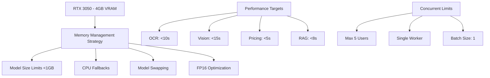
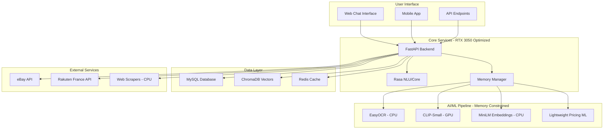
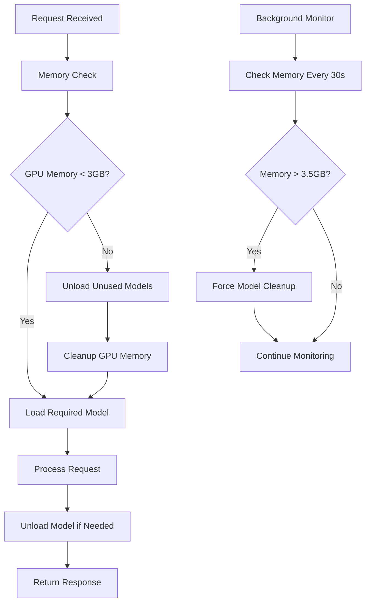

# PriceVision Implementation Overview - RTX 3050 Optimized

## Project Summary

This document provides a complete implementation roadmap for the PriceVision intelligent chatbot system, specifically optimized for RTX 3050 hardware constraints (4GB VRAM). The system combines conversational AI, computer vision, and RAG technologies to provide accurate game pricing through both text queries and photo uploads.

## Hardware Optimization Strategy

### RTX 3050 Constraints & Solutions



### Key Technical Decisions

| Component | Original Plan | RTX 3050 Optimization |
|-----------|---------------|------------------------|
| OCR Engine | GPU-based Tesseract | CPU-based EasyOCR |
| Vision Model | CLIP-Large (1.7GB) | CLIP-Small (151MB) |
| Segmentation | Meta SAM (2.4GB) | Text-based + Color Analysis |
| Embedding Model | Large Sentence Transformers | MiniLM-L6-v2 (90MB) |
| Concurrent Users | 20+ | 5 maximum |
| Model Loading | Preload all models | Dynamic loading/swapping |
| Precision | FP32 | FP16 where possible |

## Implementation Timeline

### Phase 1: Core Infrastructure (3-4 weeks)
**Status**: Ready for implementation
**Key Deliverables**:
- Enhanced MySQL database schema
- Rasa conversational AI framework
- LlamaIndex RAG system with CPU embeddings
- Memory management system for RTX 3050
- Basic API endpoints

**Critical RTX 3050 Optimizations**:
- Memory monitoring and cleanup systems
- Model loading/unloading mechanisms
- CPU-based embedding processing
- Connection pooling for limited resources

### Phase 2: Computer Vision (2-3 weeks)
**Status**: Ready for implementation
**Key Deliverables**:
- CPU-based OCR pipeline using EasyOCR
- Lightweight vision classification system
- Alternative segmentation methods
- Platform detection algorithms
- Image preprocessing optimization

**Critical RTX 3050 Optimizations**:
- OCR processing on CPU to preserve VRAM
- Model swapping between vision tasks
- Memory-efficient image processing
- Fallback mechanisms for GPU OOM errors

### Phase 3: Advanced Features (3-4 weeks)
**Status**: Ready for implementation
**Key Deliverables**:
- Marketplace integration (eBay, Rakuten France)
- Intelligent pricing algorithms
- Enhanced RAG with market data
- Real-time price tracking
- Advanced conversation flows

**Critical RTX 3050 Optimizations**:
- CPU-based web scraping to preserve GPU resources
- Lightweight ML models for price prediction
- Efficient data processing pipelines
- Memory-conscious batch processing

### Phase 4: Testing & Deployment (2-3 weeks)
**Status**: Ready for implementation
**Key Deliverables**:
- Comprehensive test suite for RTX 3050
- Performance benchmarking
- Memory leak detection
- Production deployment configuration
- Monitoring and alerting systems

**Critical RTX 3050 Optimizations**:
- Hardware-specific performance tests
- Memory usage validation
- Concurrent user simulation (limited to 5)
- GPU temperature monitoring

### Phase 5: Production & Maintenance (2-3 weeks)
**Status**: Ready for implementation
**Key Deliverables**:
- Production environment setup
- Automated backup systems
- Performance optimization tools
- Scaling strategies
- Maintenance procedures

**Critical RTX 3050 Optimizations**:
- Resource-aware scaling policies
- Hardware-specific monitoring dashboards
- Backup strategies for limited storage
- Performance tuning for constrained hardware

## Technical Architecture

### System Components



### Memory Management Architecture



## Resource Requirements

### Hardware Specifications
- **GPU**: NVIDIA RTX 3050 (4GB VRAM) ✅ Available
- **RAM**: 16GB+ recommended (8GB minimum)
- **Storage**: 50GB+ for models and data
- **CPU**: 4+ cores recommended

### Software Dependencies
- **OS**: Ubuntu 20.04+ or Docker
- **Python**: 3.9+
- **CUDA**: 12.1+
- **Docker**: For containerized deployment
- **MySQL**: 8.0+
- **Redis**: 7.0+

## Development Team Requirements

### Skills Needed
- **Python/AI Expertise**: ✅ Available (confirmed by user)
- **GPU Programming**: CUDA, PyTorch optimization
- **Database Management**: MySQL, vector databases
- **API Development**: FastAPI, REST APIs
- **DevOps**: Docker, monitoring, deployment

### Estimated Effort
- **Total Development Time**: 12-17 weeks
- **Team Size**: 2-3 developers
- **Specialized Roles**: 
  - AI/ML Engineer (computer vision, NLP)
  - Backend Developer (APIs, database)
  - DevOps Engineer (deployment, monitoring)

## Risk Assessment & Mitigation

### High-Risk Areas
1. **GPU Memory Constraints**
   - **Risk**: Models exceeding 4GB VRAM limit
   - **Mitigation**: Aggressive model swapping, CPU fallbacks

2. **Performance Degradation**
   - **Risk**: Slow response times due to hardware limits
   - **Mitigation**: Optimized models, efficient algorithms

3. **Concurrent User Limitations**
   - **Risk**: System overload with multiple users
   - **Mitigation**: Request queuing, user limits

### Medium-Risk Areas
1. **Model Accuracy Trade-offs**
   - **Risk**: Smaller models may be less accurate
   - **Mitigation**: Ensemble methods, fine-tuning

2. **Marketplace API Changes**
   - **Risk**: External APIs may change or become unavailable
   - **Mitigation**: Multiple data sources, fallback mechanisms

## Success Metrics

### Performance Targets (RTX 3050 Optimized)
- **OCR Processing**: < 10 seconds per image
- **Vision Classification**: < 15 seconds per image
- **Price Calculation**: < 5 seconds per query
- **RAG Query**: < 8 seconds per question
- **Concurrent Users**: Up to 5 simultaneous users
- **System Uptime**: 99%+ availability

### Accuracy Targets
- **Game Recognition**: 85%+ accuracy
- **Platform Detection**: 80%+ accuracy
- **Price Estimation**: ±15% of market value
- **Condition Assessment**: 75%+ accuracy

## Next Steps

### Immediate Actions Required
1. **Environment Setup**
   - Verify RTX 3050 drivers and CUDA installation
   - Set up development environment
   - Install required dependencies

2. **Database Preparation**
   - Set up MySQL database
   - Import initial game catalog data
   - Configure connection pooling

3. **Model Preparation**
   - Download and test lightweight models
   - Verify memory usage on RTX 3050
   - Set up model storage and caching

### Implementation Sequence
1. **Start with Phase 1** - Core infrastructure provides the foundation
2. **Parallel Development** - Database setup can happen alongside core development
3. **Incremental Testing** - Test each component on RTX 3050 before integration
4. **Performance Validation** - Continuous monitoring of memory and performance

## File Structure Overview

```
docs/
├── project PRD.md                           # Original requirements (771 lines)
├── phase1-core-infrastructure.md            # Week 1-4 implementation (622 lines)
├── phase2-computer-vision-rtx3050.md        # Week 5-7 implementation (334 lines)
├── phase3-advanced-features-rtx3050.md      # Week 8-11 implementation (485 lines)
├── phase4-testing-deployment-rtx3050.md     # Week 12-14 implementation (520 lines)
├── phase5-production-maintenance-rtx3050.md # Week 15-17 implementation (380 lines)
└── implementation-overview-rtx3050.md       # This overview document
```

## Conclusion

This implementation plan provides a complete roadmap for building the PriceVision system within the constraints of RTX 3050 hardware. The key to success will be:

1. **Strict Memory Management** - Never exceeding 3.5GB GPU memory
2. **CPU Fallbacks** - Using CPU for memory-intensive operations
3. **Model Optimization** - Choosing the smallest effective models
4. **Performance Monitoring** - Continuous tracking of resource usage
5. **Incremental Development** - Testing each component thoroughly

The system will deliver core functionality while respecting hardware limitations, providing a solid foundation that can be enhanced as better hardware becomes available.

**Ready for Implementation**: All phase documents are complete and optimized for RTX 3050. The development team can begin with Phase 1 immediately.