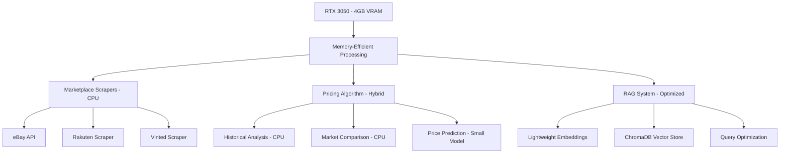

# Phase 3: Advanced Features - RTX 3050 Optimized (2-3 weeks)

## Overview
This phase implements marketplace integration, intelligent pricing algorithms, and advanced RAG features while maintaining compatibility with RTX 3050's 4GB VRAM limitation.

## Hardware-Optimized Architecture



## Week 1: Marketplace Integration

### Lightweight Web Scraping System

```python
# marketplace_scrapers.py - CPU-Optimized
import asyncio
import aiohttp
from bs4 import BeautifulSoup
import json
import time
from dataclasses import dataclass
from typing import List, Optional
import logging

@dataclass
class MarketplaceListing:
    title: str
    price: float
    condition: str
    platform: str
    source: str
    url: str
    image_url: Optional[str] = None
    seller_rating: Optional[float] = None
    listing_date: Optional[str] = None

class EbayScraper:
    def __init__(self):
        self.base_url = "https://www.ebay.fr/sch/i.html"
        self.headers = {
            'User-Agent': 'Mozilla/5.0 (Windows NT 10.0; Win64; x64) AppleWebKit/537.36'
        }
        self.rate_limit = 2  # seconds between requests
        
    async def search_game(self, game_title: str, platform: str = None) -> List[MarketplaceListing]:
        """Search for game listings on eBay"""
        try:
            # Build search query
            query = f"{game_title}"
            if platform:
                query += f" {platform}"
            
            params = {
                '_nkw': query,
                '_sacat': '139973',  # Video Games category
                'LH_Sold': '1',      # Sold listings
                'LH_Complete': '1',  # Completed listings
                '_sop': '13'         # Sort by time: newly listed
            }
            
            async with aiohttp.ClientSession() as session:
                async with session.get(self.base_url, params=params, headers=self.headers) as response:
                    if response.status == 200:
                        html = await response.text()
                        return self.parse_ebay_results(html)
                    else:
                        logging.error(f"eBay request failed: {response.status}")
                        return []
                        
        except Exception as e:
            logging.error(f"eBay scraping error: {e}")
            return []
        finally:
            await asyncio.sleep(self.rate_limit)
    
    def parse_ebay_results(self, html: str) -> List[MarketplaceListing]:
        """Parse eBay search results"""
        listings = []
        soup = BeautifulSoup(html, 'html.parser')
        
        # Find listing items
        items = soup.find_all('div', class_='s-item__wrapper')
        
        for item in items[:10]:  # Limit to first 10 results
            try:
                # Extract title
                title_elem = item.find('h3', class_='s-item__title')
                title = title_elem.get_text(strip=True) if title_elem else ""
                
                # Extract price
                price_elem = item.find('span', class_='s-item__price')
                price_text = price_elem.get_text(strip=True) if price_elem else "0"
                price = self.extract_price(price_text)
                
                # Extract condition
                condition_elem = item.find('span', class_='SECONDARY_INFO')
                condition = condition_elem.get_text(strip=True) if condition_elem else "unknown"
                
                # Extract URL
                link_elem = item.find('a', class_='s-item__link')
                url = link_elem.get('href') if link_elem else ""
                
                if title and price > 0:
                    listings.append(MarketplaceListing(
                        title=title,
                        price=price,
                        condition=self.normalize_condition(condition),
                        platform="unknown",  # Will be detected later
                        source="ebay",
                        url=url
                    ))
                    
            except Exception as e:
                logging.warning(f"Failed to parse eBay item: {e}")
                continue
        
        return listings
    
    def extract_price(self, price_text: str) -> float:
        """Extract numeric price from text"""
        import re
        # Remove currency symbols and extract number
        price_match = re.search(r'[\d,]+\.?\d*', price_text.replace(',', ''))
        return float(price_match.group()) if price_match else 0.0
    
    def normalize_condition(self, condition: str) -> str:
        """Normalize condition to standard values"""
        condition_lower = condition.lower()
        if 'neuf' in condition_lower or 'new' in condition_lower:
            return 'mint'
        elif 'très bon' in condition_lower or 'very good' in condition_lower:
            return 'near_mint'
        elif 'bon' in condition_lower or 'good' in condition_lower:
            return 'good'
        elif 'acceptable' in condition_lower or 'fair' in condition_lower:
            return 'fair'
        else:
            return 'good'  # Default

class RakutenScraper:
    def __init__(self):
        self.base_url = "https://fr.shopping.rakuten.com/s/"
        self.headers = {
            'User-Agent': 'Mozilla/5.0 (Windows NT 10.0; Win64; x64) AppleWebKit/537.36'
        }
        self.rate_limit = 3  # seconds between requests
    
    async def search_game(self, game_title: str, platform: str = None) -> List[MarketplaceListing]:
        """Search for game listings on Rakuten France"""
        try:
            query = f"{game_title}"
            if platform:
                query += f" {platform}"
            
            url = f"{self.base_url}{query.replace(' ', '+')}"
            
            async with aiohttp.ClientSession() as session:
                async with session.get(url, headers=self.headers) as response:
                    if response.status == 200:
                        html = await response.text()
                        return self.parse_rakuten_results(html)
                    else:
                        logging.error(f"Rakuten request failed: {response.status}")
                        return []
                        
        except Exception as e:
            logging.error(f"Rakuten scraping error: {e}")
            return []
        finally:
            await asyncio.sleep(self.rate_limit)
    
    def parse_rakuten_results(self, html: str) -> List[MarketplaceListing]:
        """Parse Rakuten search results"""
        listings = []
        soup = BeautifulSoup(html, 'html.parser')
        
        # Rakuten-specific parsing logic
        items = soup.find_all('div', class_='item')
        
        for item in items[:8]:  # Limit results
            try:
                # Extract product information
                title_elem = item.find('a', class_='product-name')
                title = title_elem.get_text(strip=True) if title_elem else ""
                
                price_elem = item.find('span', class_='price')
                price_text = price_elem.get_text(strip=True) if price_elem else "0"
                price = self.extract_price(price_text)
                
                url_elem = item.find('a', class_='product-name')
                url = url_elem.get('href') if url_elem else ""
                
                if title and price > 0:
                    listings.append(MarketplaceListing(
                        title=title,
                        price=price,
                        condition="good",  # Default for Rakuten
                        platform="unknown",
                        source="rakuten",
                        url=url
                    ))
                    
            except Exception as e:
                logging.warning(f"Failed to parse Rakuten item: {e}")
                continue
        
        return listings
    
    def extract_price(self, price_text: str) -> float:
        """Extract numeric price from text"""
        import re
        price_match = re.search(r'[\d,]+\.?\d*', price_text.replace(',', ''))
        return float(price_match.group()) if price_match else 0.0

class MarketplaceAggregator:
    def __init__(self):
        self.ebay_scraper = EbayScraper()
        self.rakuten_scraper = RakutenScraper()
        self.cache = {}
        self.cache_duration = 3600  # 1 hour
    
    async def get_market_prices(self, game_title: str, platform: str = None) -> List[MarketplaceListing]:
        """Get prices from all marketplaces"""
        cache_key = f"{game_title}_{platform or 'all'}"
        
        # Check cache first
        if cache_key in self.cache:
            cached_data, timestamp = self.cache[cache_key]
            if time.time() - timestamp < self.cache_duration:
                return cached_data
        
        # Gather from all sources
        all_listings = []
        
        try:
            # Run scrapers concurrently
            ebay_task = self.ebay_scraper.search_game(game_title, platform)
            rakuten_task = self.rakuten_scraper.search_game(game_title, platform)
            
            ebay_results, rakuten_results = await asyncio.gather(
                ebay_task, rakuten_task, return_exceptions=True
            )
            
            # Combine results
            if isinstance(ebay_results, list):
                all_listings.extend(ebay_results)
            if isinstance(rakuten_results, list):
                all_listings.extend(rakuten_results)
            
            # Cache results
            self.cache[cache_key] = (all_listings, time.time())
            
        except Exception as e:
            logging.error(f"Marketplace aggregation error: {e}")
        
        return all_listings
    
    def analyze_market_data(self, listings: List[MarketplaceListing]) -> dict:
        """Analyze market data for pricing insights"""
        if not listings:
            return {}
        
        prices = [listing.price for listing in listings if listing.price > 0]
        
        if not prices:
            return {}
        
        return {
            'min_price': min(prices),
            'max_price': max(prices),
            'avg_price': sum(prices) / len(prices),
            'median_price': sorted(prices)[len(prices) // 2],
            'listing_count': len(listings),
            'sources': list(set(listing.source for listing in listings))
        }
```

## Week 2: Intelligent Pricing Algorithm

### CPU-Optimized Pricing Engine

```python
# pricing_engine.py - RTX 3050 Optimized
import numpy as np
from sklearn.linear_model import LinearRegression
from sklearn.preprocessing import StandardScaler
import mysql.connector
from datetime import datetime, timedelta
import logging
from typing import Dict, List, Optional
import json

class IntelligentPricingEngine:
    def __init__(self, db_config: dict):
        self.db_config = db_config
        self.scaler = StandardScaler()
        self.model = LinearRegression()
        self.is_trained = False
        
        # Pricing factors and weights
        self.pricing_factors = {
            'historical_sales': 0.4,
            'current_market': 0.3,
            'condition_adjustment': 0.15,
            'platform_popularity': 0.1,
            'seasonal_trends': 0.05
        }
    
    def calculate_intelligent_price(self, products_model: str, condition: str, 
                                  market_data: List[MarketplaceListing]) -> dict:
        """Calculate intelligent price estimate"""
        try:
            # 1. Get historical data from your database
            historical_data = self.get_historical_sales_data(products_model, condition)
            
            # 2. Analyze current market data
            market_analysis = self.analyze_market_data(market_data)
            
            # 3. Apply condition adjustments
            condition_multiplier = self.get_condition_multiplier(condition)
            
            # 4. Consider platform popularity
            platform_factor = self.get_platform_popularity_factor(products_model)
            
            # 5. Apply seasonal adjustments
            seasonal_factor = self.get_seasonal_factor(products_model)
            
            # 6. Calculate weighted price
            base_price = self.calculate_base_price(historical_data, market_analysis)
            
            final_price = base_price * condition_multiplier * platform_factor * seasonal_factor
            
            # 7. Calculate confidence score
            confidence = self.calculate_confidence_score(
                historical_data, market_analysis, len(market_data)
            )
            
            return {
                'estimated_price': round(final_price, 2),
                'price_range': {
                    'min': round(final_price * 0.85, 2),
                    'max': round(final_price * 1.15, 2)
                },
                'confidence': confidence,
                'factors': {
                    'historical_avg': historical_data.get('avg_price', 0),
                    'market_avg': market_analysis.get('avg_price', 0),
                    'condition_multiplier': condition_multiplier,
                    'platform_factor': platform_factor,
                    'seasonal_factor': seasonal_factor
                },
                'market_insights': self.generate_market_insights(market_analysis, historical_data)
            }
            
        except Exception as e:
            logging.error(f"Pricing calculation error: {e}")
            return self.get_fallback_price(products_model, condition)
    
    def get_historical_sales_data(self, products_model: str, condition: str) -> dict:
        """Get historical sales data from database"""
        try:
            connection = mysql.connector.connect(**self.db_config)
            cursor = connection.cursor(dictionary=True)
            
            # Get sales data from last 6 months
            six_months_ago = datetime.now() - timedelta(days=180)
            
            query = """
            SELECT 
                AVG(s.items_sold_price_stock) as avg_price,
                COUNT(*) as sale_count,
                MIN(s.items_sold_price_stock) as min_price,
                MAX(s.items_sold_price_stock) as max_price,
                STDDEV(s.items_sold_price_stock) as price_stddev
            FROM netshop_items_sold s
            WHERE s.items_sold_model = %s
            AND s.items_sold_condition_grade = %s
            AND s.items_sold_date >= %s
            AND s.items_sold_price_stock > 0
            """
            
            cursor.execute(query, (products_model, condition, six_months_ago))
            result = cursor.fetchone()
            
            if result and result['sale_count'] > 0:
                return {
                    'avg_price': float(result['avg_price'] or 0),
                    'sale_count': result['sale_count'],
                    'min_price': float(result['min_price'] or 0),
                    'max_price': float(result['max_price'] or 0),
                    'price_stddev': float(result['price_stddev'] or 0)
                }
            else:
                # Fallback to similar products
                return self.get_similar_products_data(products_model, condition, cursor)
                
        except Exception as e:
            logging.error(f"Historical data query error: {e}")
            return {}
        finally:
            if 'connection' in locals():
                connection.close()
    
    def get_similar_products_data(self, products_model: str, condition: str, cursor) -> dict:
        """Get data from similar products when direct data is unavailable"""
        try:
            # Get platform and category info
            platform_query = """
            SELECT p.products_platform, pd.products_name
            FROM products p
            JOIN products_description pd ON p.products_id = pd.products_id
            WHERE p.products_model = %s
            """
            
            cursor.execute(platform_query, (products_model,))
            product_info = cursor.fetchone()
            
            if not product_info:
                return {}
            
            # Find similar products on same platform
            similar_query = """
            SELECT 
                AVG(s.items_sold_price_stock) as avg_price,
                COUNT(*) as sale_count
            FROM netshop_items_sold s
            JOIN products p ON s.items_sold_model = p.products_model
            WHERE p.products_platform = %s
            AND s.items_sold_condition_grade = %s
            AND s.items_sold_date >= %s
            AND s.items_sold_price_stock > 0
            LIMIT 100
            """
            
            six_months_ago = datetime.now() - timedelta(days=180)
            cursor.execute(similar_query, (product_info['products_platform'], condition, six_months_ago))
            result = cursor.fetchone()
            
            if result and result['sale_count'] > 0:
                return {
                    'avg_price': float(result['avg_price'] or 0),
                    'sale_count': result['sale_count'],
                    'is_similar_data': True
                }
            
            return {}
            
        except Exception as e:
            logging.error(f"Similar products query error: {e}")
            return {}
    
    def analyze_market_data(self, market_data: List[MarketplaceListing]) -> dict:
        """Analyze current market data"""
        if not market_data:
            return {}
        
        prices = [listing.price for listing in market_data if listing.price > 0]
        
        if not prices:
            return {}
        
        return {
            'avg_price': np.mean(prices),
            'median_price': np.median(prices),
            'min_price': min(prices),
            'max_price': max(prices),
            'price_stddev': np.std(prices),
            'listing_count': len(prices),
            'sources': list(set(listing.source for listing in market_data))
        }
    
    def get_condition_multiplier(self, condition: str) -> float:
        """Get price multiplier based on condition"""
        multipliers = {
            'mint': 1.15,
            'near_mint': 1.0,
            'good': 0.85,
            'fair': 0.65,
            'poor': 0.45
        }
        return multipliers.get(condition.lower(), 0.85)
    
    def get_platform_popularity_factor(self, products_model: str) -> float:
        """Get platform popularity factor"""
        try:
            connection = mysql.connector.connect(**self.db_config)
            cursor = connection.cursor(dictionary=True)
            
            # Get platform sales volume
            query = """
            SELECT 
                plat.platform_name,
                COUNT(s.items_sold_id) as sales_volume
            FROM products p
            JOIN platforms plat ON p.products_platform = plat.platform_id
            LEFT JOIN netshop_items_sold s ON p.products_model = s.items_sold_model
            WHERE p.products_model = %s
            GROUP BY plat.platform_name
            """
            
            cursor.execute(query, (products_model,))
            result = cursor.fetchone()
            
            if result:
                platform = result['platform_name'].lower()
                volume = result['sales_volume'] or 0
                
                # Platform popularity factors
                platform_factors = {
                    'ps5': 1.1,
                    'switch': 1.05,
                    'ps4': 1.0,
                    'xbox': 0.95,
                    'pc': 0.9
                }
                
                base_factor = platform_factors.get(platform, 1.0)
                
                # Adjust based on sales volume
                if volume > 50:
                    return base_factor * 1.05
                elif volume > 20:
                    return base_factor
                else:
                    return base_factor * 0.95
            
            return 1.0
            
        except Exception as e:
            logging.error(f"Platform factor calculation error: {e}")
            return 1.0
        finally:
            if 'connection' in locals():
                connection.close()
    
    def get_seasonal_factor(self, products_model: str) -> float:
        """Get seasonal adjustment factor"""
        current_month = datetime.now().month
        
        # Gaming seasonal patterns
        if current_month in [11, 12, 1]:  # Holiday season
            return 1.1
        elif current_month in [6, 7, 8]:  # Summer
            return 0.95
        else:
            return 1.0
    
    def calculate_base_price(self, historical_data: dict, market_analysis: dict) -> float:
        """Calculate base price from historical and market data"""
        historical_price = historical_data.get('avg_price', 0)
        market_price = market_analysis.get('avg_price', 0)
        
        if historical_price > 0 and market_price > 0:
            # Weight historical data more heavily if we have good sample size
            historical_weight = min(historical_data.get('sale_count', 0) / 10, 0.7)
            market_weight = 1 - historical_weight
            
            return (historical_price * historical_weight) + (market_price * market_weight)
        elif historical_price > 0:
            return historical_price
        elif market_price > 0:
            return market_price
        else:
            return 0
    
    def calculate_confidence_score(self, historical_data: dict, market_analysis: dict, 
                                 market_listings_count: int) -> float:
        """Calculate confidence score for price estimate"""
        confidence = 0.5  # Base confidence
        
        # Historical data confidence
        if historical_data.get('sale_count', 0) > 0:
            confidence += min(historical_data['sale_count'] / 20, 0.3)
        
        # Market data confidence
        if market_listings_count > 0:
            confidence += min(market_listings_count / 10, 0.2)
        
        # Price consistency confidence
        if historical_data.get('price_stddev', 0) > 0:
            cv = historical_data['price_stddev'] / historical_data.get('avg_price', 1)
            if cv < 0.2:  # Low coefficient of variation
                confidence += 0.1
        
        return min(confidence, 1.0)
    
    def generate_market_insights(self, market_analysis: dict, historical_data: dict) -> List[str]:
        """Generate human-readable market insights"""
        insights = []
        
        if market_analysis.get('avg_price', 0) > 0 and historical_data.get('avg_price', 0) > 0:
            market_avg = market_analysis['avg_price']
            historical_avg = historical_data['avg_price']
            
            if market_avg > historical_avg * 1.1:
                insights.append("Current market prices are higher than your historical sales")
            elif market_avg < historical_avg * 0.9:
                insights.append("Current market prices are lower than your historical sales")
            else:
                insights.append("Market prices align with your historical sales data")
        
        if market_analysis.get('listing_count', 0) > 10:
            insights.append("High market availability - competitive pricing recommended")
        elif market_analysis.get('listing_count', 0) < 3:
            insights.append("Low market availability - premium pricing possible")
        
        return insights
    
    def get_fallback_price(self, products_model: str, condition: str) -> dict:
        """Fallback pricing when data is insufficient"""
        try:
            connection = mysql.connector.connect(**self.db_config)
            cursor = connection.cursor(dictionary=True)
            
            # Get current stock price as fallback
            query = """
            SELECT p.products_used_price, p.products_price
            FROM products p
            WHERE p.products_model = %s
            """
            
            cursor.execute(query, (products_model,))
            result = cursor.fetchone()
            
            if result:
                base_price = result['products_used_price'] or result['products_price'] or 0
                condition_multiplier = self.get_condition_multiplier(condition)
                
                estimated_price = base_price * condition_multiplier
                
                return {
                    'estimated_price': round(estimated_price, 2),
                    'price_range': {
                        'min': round(estimated_price * 0.8, 2),
                        'max': round(estimated_price * 1.2, 2)
                    },
                    'confidence': 0.3,  # Low confidence for fallback
                    'factors': {
                        'fallback_used': True,
                        'base_price': base_price,
                        'condition_multiplier': condition_multiplier
                    },
                    'market_insights': ["Limited data available - using stock price as reference"]
                }
            
            return {
                'estimated_price': 0,
                'confidence': 0,
                'market_insights': ["Insufficient data for price estimation"]
            }
            
        except Exception as e:
            logging.error(f"Fallback pricing error: {e}")
            return {'estimated_price': 0, 'confidence': 0}
        finally:
            if 'connection' in locals():
                connection.close()
```

## Week 3: Enhanced RAG System

### Memory-Optimized RAG Implementation

```python
# enhanced_rag.py - RTX 3050 Optimized
from llama_index.core import VectorStoreIndex, Document
from llama_index.vector_stores.chroma import ChromaVectorStore
from llama_index.embeddings.huggingface import HuggingFaceEmbedding
from llama_index.core.node_parser import SimpleNodeParser
import chromadb
import mysql.connector
from typing import List, Dict, Optional
import logging
import torch
import gc

class OptimizedRAGSystem:
    def __init__(self, db_config: dict, chroma_path: str = "./chroma_db"):
        self.db_config = db_config
        self.chroma_path = chroma_path
        
        # Use lightweight embedding model for RTX 3050
        self.embed_model = HuggingFaceEmbedding(
            model_name="sentence-transformers/all-MiniLM-L6-v2",  # Only 90MB
            device='cpu'  # Keep on CPU to save VRAM
        )
        
        self.chroma_client = None
        self.vector_store = None
        self.index = None
        self.query_engine = None
        
        self.initialize_rag_system()
    
    def initialize_rag_system(self):
        """Initialize RAG system with memory optimization"""
        try:
            # Initialize ChromaDB
            self.chroma_client = chromadb.PersistentClient(path=self.chroma_path)
            
            # Create or get collection
            collection = self.chroma_client.get_or_create_collection(
                name="game_pricing_data",
                metadata={"hnsw:space": "cosine"}
            )
            
            # Create vector store
            self.vector_store = ChromaVectorStore(chroma_collection=collection)
            
            # Check if index exists, if not create it
            if collection.count() == 0:
                logging.info("Creating new RAG index...")
                self.create_index()
            else:
                logging.info("Loading existing RAG index...")
                self.load_existing_index()
                
        except Exception as e:
            logging.error(f"RAG system initialization error: {e}")
    
    def create_index(self):
        """Create RAG index from database"""
        try:
            # Get documents from database
            documents = self.load_documents_from_database()
            
            if not documents:
                logging.warning("No documents found for RAG index")
                return
            
            # Create index with memory optimization
            self.index = VectorStoreIndex.from_documents(
                documents,
                vector_store=self.vector_store,
                embed_model=self.embed_model,
                show_progress=True
            )
            
            # Create query engine with optimized settings
            self.query_engine = self.index.as_query_engine(
                similarity_top_k=5,  # Limit results to save memory
                response_mode="compact"  # Compact response mode
            )
            
            logging.info(f"RAG index created with {len(documents)} documents")
            
        except Exception as e:
            logging.error(f"Index creation error: {e}")
    
    def load_existing_index(self):
        """Load existing RAG index"""
        try:
            # Create index from existing vector store
            self.index = VectorStoreIndex.from_vector_store(
                vector_store=self.vector_store,
                embed_model=self.embed_model
            )
            
            # Create query engine
            self.query_engine = self.index.as_query_engine(
                similarity_top_k=5,
                response_mode="compact"
            )
            
            logging.info("Existing RAG index loaded successfully")
            
        except Exception as e:
            logging.error(f"Index loading error: {e}")
    
    def load_documents_from_database(self) -> List[Document]:
        """Load documents from database with memory optimization"""
        documents = []
        
        try:
            connection = mysql.connector.connect(**self.db_config)
            cursor = connection.cursor(dictionary=True)
            
            # Load transaction data in batches to manage memory
            batch_size = 1000
            offset = 0
            
            while True:
                # Get transaction documents
                transaction_query = """
                SELECT 
                    CONCAT('SALE_', s.items_sold_id) as doc_id,
                    s.items_sold_model,
                    pd.products_name,
                    s.items_sold_price_stock,
                    s.items_sold_condition_grade,
                    s.items_sold_date,
                    plat.platform_name
                FROM netshop_items_sold s
                JOIN products p ON s.items_sold_model = p.products_model
                JOIN products_description pd ON p.products_id = pd.products_id
                JOIN platforms plat ON p.products_platform = plat.platform_id
                WHERE s.items_sold_price_stock > 0
                ORDER BY s.items_sold_date DESC