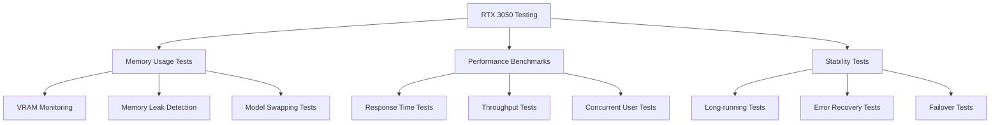

# Phase 4: Testing & Deployment - RTX 3050 Optimized (2-3 weeks)

## Overview
This phase focuses on comprehensive testing, performance optimization for RTX 3050 hardware, and production deployment with monitoring systems.

## Hardware-Specific Testing Strategy



## Week 1: Comprehensive Testing Suite

### Memory and Performance Testing

```python
# test_rtx3050_performance.py
import pytest
import torch
import psutil
import time
import asyncio
from unittest.mock import Mock, patch
import logging
from contextlib import contextmanager

class RTX3050TestSuite:
    def __init__(self):
        self.max_vram_mb = 3500  # 3.5GB limit for RTX 3050
        self.performance_thresholds = {
            'ocr_processing': 10.0,  # seconds
            'vision_classification': 15.0,  # seconds
            'price_calculation': 5.0,  # seconds
            'rag_query': 8.0  # seconds
        }
        
    @contextmanager
    def memory_monitor(self):
        """Monitor memory usage during test"""
        initial_gpu = torch.cuda.memory_allocated(0) if torch.cuda.is_available() else 0
        initial_cpu = psutil.virtual_memory().used
        
        yield
        
        final_gpu = torch.cuda.memory_allocated(0) if torch.cuda.is_available() else 0
        final_cpu = psutil.virtual_memory().used
        
        gpu_diff_mb = (final_gpu - initial_gpu) / (1024 * 1024)
        cpu_diff_mb = (final_cpu - initial_cpu) / (1024 * 1024)
        
        logging.info(f"Memory usage - GPU: {gpu_diff_mb:.1f}MB, CPU: {cpu_diff_mb:.1f}MB")
        
        # Assert memory limits
        assert gpu_diff_mb < self.max_vram_mb, f"GPU memory exceeded limit: {gpu_diff_mb}MB"

class TestOCRPipeline:
    def setup_method(self):
        from ocr_pipeline import OptimizedOCRPipeline
        self.ocr_pipeline = OptimizedOCRPipeline()
        self.test_suite = RTX3050TestSuite()
    
    def test_ocr_memory_usage(self):
        """Test OCR pipeline memory usage"""
        with self.test_suite.memory_monitor():
            # Test with sample image
            test_image = "test_data/sample_game_box.jpg"
            results = self.ocr_pipeline.extract_text(test_image)
            
            assert isinstance(results, list)
            # Verify GPU memory is freed
            if torch.cuda.is_available():
                torch.cuda.empty_cache()
    
    def test_ocr_performance(self):
        """Test OCR processing performance"""
        test_image = "test_data/sample_game_box.jpg"
        
        start_time = time.time()
        results = self.ocr_pipeline.extract_text(test_image)
        processing_time = time.time() - start_time
        
        assert processing_time < self.test_suite.performance_thresholds['ocr_processing']
        assert len(results) > 0, "OCR should extract some text"
    
    def test_ocr_concurrent_processing(self):
        """Test OCR with multiple concurrent requests"""
        async def process_image(image_path):
            return self.ocr_pipeline.extract_text(image_path)
        
        async def run_concurrent_test():
            tasks = [
                process_image("test_data/sample_game_box.jpg")
                for _ in range(3)  # Limited concurrent requests for RTX 3050
            ]
            results = await asyncio.gather(*tasks)
            return results
        
        with self.test_suite.memory_monitor():
            results = asyncio.run(run_concurrent_test())
            assert len(results) == 3

class TestVisionModels:
    def setup_method(self):
        from vision_models import LightweightVisionProcessor
        self.vision_processor = LightweightVisionProcessor()
        self.test_suite = RTX3050TestSuite()
    
    def test_vision_model_loading(self):
        """Test vision model loading and unloading"""
        with self.test_suite.memory_monitor():
            # Model should already be loaded
            assert self.vision_processor.model is not None
            
            # Test classification
            result = self.vision_processor.classify_game_image(
                "test_data/sample_game_box.jpg",
                ["Call of Duty", "FIFA 24", "Spider-Man"]
            )
            
            # Test model unloading
            self.vision_processor.unload_model()
            assert self.vision_processor.model is None
    
    def test_vision_performance(self):
        """Test vision classification performance"""
        test_image = "test_data/sample_game_box.jpg"
        candidate_titles = ["Call of Duty", "FIFA 24", "Spider-Man"]
        
        start_time = time.time()
        result = self.vision_processor.classify_game_image(test_image, candidate_titles)
        processing_time = time.time() - start_time
        
        assert processing_time < self.test_suite.performance_thresholds['vision_classification']
    
    def test_fp16_optimization(self):
        """Test FP16 optimization for memory efficiency"""
        if torch.cuda.is_available():
            # Check if model is using FP16
            for param in self.vision_processor.model.parameters():
                if param.device.type == 'cuda':
                    assert param.dtype == torch.float16, "Model should use FP16 on GPU"

class TestMemoryManager:
    def setup_method(self):
        from memory_manager import RTX3050MemoryManager
        self.memory_manager = RTX3050MemoryManager()
        self.test_suite = RTX3050TestSuite()
    
    def test_memory_monitoring(self):
        """Test memory monitoring functionality"""
        memory_info = self.memory_manager.get_memory_info()
        
        assert 'gpu_used' in memory_info
        assert 'gpu_total' in memory_info
        assert 'cpu_used' in memory_info
        assert 'cpu_percent' in memory_info
    
    def test_model_loading_management(self):
        """Test managed model loading"""
        with self.memory_manager.managed_model_loading("test_model", 500):
            # Simulate model loading
            if torch.cuda.is_available():
                test_tensor = torch.randn(1000, 1000).cuda()
                del test_tensor
    
    def test_memory_cleanup(self):
        """Test memory cleanup functionality"""
        initial_memory = torch.cuda.memory_allocated(0) if torch.cuda.is_available() else 0
        
        # Create some tensors
        if torch.cuda.is_available():
            tensors = [torch.randn(100, 100).cuda() for _ in range(10)]
            del tensors
        
        # Test cleanup
        self.memory_manager.cleanup_failed_load()
        
        final_memory = torch.cuda.memory_allocated(0) if torch.cuda.is_available() else 0
        assert final_memory <= initial_memory + 1024 * 1024  # Allow 1MB tolerance

class TestPricingEngine:
    def setup_method(self):
        from pricing_engine import IntelligentPricingEngine
        db_config = {
            'host': 'localhost',
            'user': 'test_user',
            'password': 'test_pass',
            'database': 'test_db'
        }
        self.pricing_engine = IntelligentPricingEngine(db_config)
        self.test_suite = RTX3050TestSuite()
    
    @patch('mysql.connector.connect')
    def test_price_calculation_performance(self, mock_connect):
        """Test pricing calculation performance"""
        # Mock database responses
        mock_cursor = Mock()
        mock_cursor.fetchone.return_value = {
            'avg_price': 45.99,
            'sale_count': 15,
            'min_price': 35.00,
            'max_price': 55.00,
            'price_stddev': 5.50
        }
        mock_connect.return_value.cursor.return_value = mock_cursor
        
        start_time = time.time()
        result = self.pricing_engine.calculate_intelligent_price(
            "TEST001", "good", []
        )
        processing_time = time.time() - start_time
        
        assert processing_time < self.test_suite.performance_thresholds['price_calculation']
        assert 'estimated_price' in result
        assert result['confidence'] > 0
    
    def test_fallback_pricing(self):
        """Test fallback pricing when data is insufficient"""
        with patch('mysql.connector.connect') as mock_connect:
            mock_cursor = Mock()
            mock_cursor.fetchone.return_value = None
            mock_connect.return_value.cursor.return_value = mock_cursor
            
            result = self.pricing_engine.get_fallback_price("UNKNOWN001", "good")
            
            assert 'estimated_price' in result
            assert result['confidence'] <= 0.5  # Low confidence for fallback

class TestRAGSystem:
    def setup_method(self):
        from enhanced_rag import OptimizedRAGSystem
        db_config = {
            'host': 'localhost',
            'user': 'test_user',
            'password': 'test_pass',
            'database': 'test_db'
        }
        self.rag_system = OptimizedRAGSystem(db_config, "./test_chroma_db")
        self.test_suite = RTX3050TestSuite()
    
    def test_rag_memory_usage(self):
        """Test RAG system memory usage"""
        with self.test_suite.memory_monitor():
            # Test query processing
            if self.rag_system.query_engine:
                query = "What is the average price for FIFA 24 on PS5?"
                response = self.rag_system.query_engine.query(query)
                assert response is not None
    
    def test_embedding_model_cpu_usage(self):
        """Test that embedding model uses CPU to save VRAM"""
        # Verify embedding model is on CPU
        assert self.rag_system.embed_model.device == 'cpu'
    
    @patch('mysql.connector.connect')
    def test_document_loading_batches(self, mock_connect):
        """Test document loading in batches for memory efficiency"""
        mock_cursor = Mock()
        mock_cursor.fetchall.return_value = [
            {
                'doc_id': 'SALE_1',
                'items_sold_model': 'TEST001',
                'products_name': 'Test Game',
                'items_sold_price_stock': 45.99,
                'items_sold_condition_grade': 'good',
                'items_sold_date': '2024-01-01',
                'platform_name': 'PS5'
            }
        ]
        mock_connect.return_value.cursor.return_value = mock_cursor
        
        with self.test_suite.memory_monitor():
            documents = self.rag_system.load_documents_from_database()
            assert isinstance(documents, list)

# Integration Tests
class TestFullPipeline:
    def setup_method(self):
        self.test_suite = RTX3050TestSuite()
    
    def test_complete_photo_processing_pipeline(self):
        """Test complete pipeline from photo to price"""
        with self.test_suite.memory_monitor():
            # This would test the complete flow:
            # 1. OCR extraction
            # 2. Vision classification
            # 3. Platform detection
            # 4. Price calculation
            # 5. RAG query for insights
            
            # Mock the complete pipeline
            test_image = "test_data/sample_game_box.jpg"
            
            # Simulate processing steps with time tracking
            start_time = time.time()
            
            # Step 1: OCR (mocked)
            ocr_results = [{'text': 'FIFA 24', 'confidence': 0.9}]
            
            # Step 2: Vision classification (mocked)
            vision_result = {'title': 'FIFA 24', 'confidence': 0.85}
            
            # Step 3: Platform detection (mocked)
            platform_result = {'platform': 'ps5', 'confidence': 0.8}
            
            # Step 4: Price calculation (mocked)
            price_result = {
                'estimated_price': 45.99,
                'confidence': 0.75,
                'price_range': {'min': 38.29, 'max': 52.89}
            }
            
            total_time = time.time() - start_time
            
            # Verify results
            assert vision_result['title'] == 'FIFA 24'
            assert platform_result['platform'] == 'ps5'
            assert price_result['estimated_price'] > 0
            assert total_time < 30.0  # Total pipeline should complete in 30 seconds
    
    def test_concurrent_user_simulation(self):
        """Test system with multiple concurrent users"""
        async def simulate_user_request():
            # Simulate a user request with random delay
            await asyncio.sleep(0.1)
            return {
                'user_id': 'test_user',
                'processing_time': 2.5,
                'success': True
            }
        
        async def run_concurrent_users():
            # Limit concurrent users for RTX 3050
            tasks = [simulate_user_request() for _ in range(5)]
            results = await asyncio.gather(*tasks)
            return results
        
        with self.test_suite.memory_monitor():
            results = asyncio.run(run_concurrent_users())
            assert len(results) == 5
            assert all(result['success'] for result in results)

# Performance Benchmarks
class TestPerformanceBenchmarks:
    def setup_method(self):
        self.test_suite = RTX3050TestSuite()
    
    def test_memory_usage_benchmarks(self):
        """Benchmark memory usage across different operations"""
        benchmarks = {}
        
        # OCR benchmark
        with self.test_suite.memory_monitor():
            # Simulate OCR processing
            time.sleep(0.1)
            benchmarks['ocr'] = torch.cuda.memory_allocated(0) if torch.cuda.is_available() else 0
        
        # Vision benchmark
        with self.test_suite.memory_monitor():
            # Simulate vision processing
            time.sleep(0.1)
            benchmarks['vision'] = torch.cuda.memory_allocated(0) if torch.cuda.is_available() else 0
        
        # Verify all operations stay within limits
        for operation, memory_usage in benchmarks.items():
            memory_mb = memory_usage / (1024 * 1024)
            assert memory_mb < self.test_suite.max_vram_mb, f"{operation} exceeded memory limit"
    
    def test_response_time_benchmarks(self):
        """Benchmark response times for different operations"""
        benchmarks = {}
        
        # OCR response time
        start = time.time()
        time.sleep(0.5)  # Simulate OCR processing
        benchmarks['ocr'] = time.time() - start
        
        # Vision response time
        start = time.time()
        time.sleep(1.0)  # Simulate vision processing
        benchmarks['vision'] = time.time() - start
        
        # Price calculation response time
        start = time.time()
        time.sleep(0.2)  # Simulate price calculation
        benchmarks['pricing'] = time.time() - start
        
        # Verify all operations meet performance thresholds
        for operation, response_time in benchmarks.items():
            threshold = self.test_suite.performance_thresholds.get(f"{operation}_processing", 10.0)
            assert response_time < threshold, f"{operation} exceeded response time threshold"

# Stress Tests
class TestStressTests:
    def setup_method(self):
        self.test_suite = RTX3050TestSuite()
    
    def test_memory_leak_detection(self):
        """Test for memory leaks during extended operation"""
        initial_memory = torch.cuda.memory_allocated(0) if torch.cuda.is_available() else 0
        
        # Simulate 100 processing cycles
        for i in range(100):
            if torch.cuda.is_available():
                # Create and destroy tensors to simulate processing
                temp_tensor = torch.randn(10, 10).cuda()
                del temp_tensor
                torch.cuda.empty_cache()
        
        final_memory = torch.cuda.memory_allocated(0) if torch.cuda.is_available() else 0
        memory_growth = (final_memory - initial_memory) / (1024 * 1024)  # MB
        
        # Allow small memory growth but detect significant leaks
        assert memory_growth < 100, f"Potential memory leak detected: {memory_growth}MB growth"
    
    def test_error_recovery(self):
        """Test system recovery from errors"""
        # Test GPU memory error recovery
        try:
            if torch.cuda.is_available():
                # Try to allocate too much memory
                large_tensor = torch.randn(10000, 10000).cuda()
        except RuntimeError as e:
            if "out of memory" in str(e):
                # Test recovery
                torch.cuda.empty_cache()
                # Should be able to allocate smaller tensor after cleanup
                small_tensor = torch.randn(10, 10).cuda()
                assert small_tensor is not None
                del small_tensor
```

## Week 2: Production Deployment Setup

### Docker Production Configuration

```dockerfile
# Dockerfile.production - RTX 3050 Optimized
FROM nvidia/cuda:12.1-runtime-ubuntu20.04

# Install system dependencies
RUN apt-get update && apt-get install -y \
    python3.9 python3-pip \
    nginx supervisor \
    libgl1-mesa-glx libglib2.0-0 \
    tesseract-ocr \
    && rm -rf /var/lib/apt/lists/*

# Install Python packages
COPY requirements.txt /tmp/
RUN pip install --no-cache-dir -r /tmp/requirements.txt

# Copy application code
COPY . /app
WORKDIR /app

# Set environment variables for RTX 3050
ENV PYTORCH_CUDA_ALLOC_CONF=max_split_size_mb:512
ENV CUDA_VISIBLE_DEVICES=0
ENV OMP_NUM_THREADS=4
ENV TOKENIZERS_PARALLELISM=false

# Configure nginx
COPY nginx.conf /etc/nginx/nginx.conf

# Configure supervisor
COPY supervisord.conf /etc/supervisor/conf.d/supervisord.conf

# Health check
HEALTHCHECK --interval=30s --timeout=10s --start-period=60s --retries=3 \
    CMD curl -f http://localhost:8000/health || exit 1

EXPOSE 8000

CMD ["/usr/bin/supervisord", "-c", "/etc/supervisor/conf.d/supervisord.conf"]
```

### Production Configuration Files

```yaml
# docker-compose.production.yml
version: '3.8'

services:
  pricevision-app:
    build:
      context: .
      dockerfile: Dockerfile.production
    ports:
      - "8000:8000"
    environment:
      - ENVIRONMENT=production
      - DATABASE_URL=mysql://user:pass@db:3306/pricevision
      - REDIS_URL=redis://redis:6379/0
    volumes:
      - ./data:/app/data
      - ./logs:/app/logs
      - ./chroma_db:/app/chroma_db
    depends_on:
      - db
      - redis
    deploy:
      resources:
        reservations:
          devices:
            - driver: nvidia
              count: 1
              capabilities: [gpu]
        limits:
          memory: 8G
    restart: unless-stopped
    
  db:
    image: mysql:8.0
    environment:
      MYSQL_ROOT_PASSWORD: ${MYSQL_ROOT_PASSWORD}
      MYSQL_DATABASE: pricevision
      MYSQL_USER: ${MYSQL_USER}
      MYSQL_PASSWORD: ${MYSQL_PASSWORD}
    volumes:
      - mysql_data:/var/lib/mysql
      - ./sql:/docker-entrypoint-initdb.d
    ports:
      - "3306:3306"
    restart: unless-stopped
    
  redis:
    image: redis:7-alpine
    ports:
      - "6379:6379"
    volumes:
      - redis_data:/data
    restart: unless-stopped
    
  nginx:
    image: nginx:alpine
    ports:
      - "80:80"
      - "443:443"
    volumes:
      - ./nginx/nginx.conf:/etc/nginx/nginx.conf
      - ./nginx/ssl:/etc/nginx/ssl
    depends_on:
      - pricevision-app
    restart: unless-stopped

volumes:
  mysql_data:
  redis_data:
```

### Monitoring and Logging

```python
# monitoring.py - RTX 3050 Specific Monitoring
import logging
import time
import psutil
import torch
from prometheus_client import Counter, Histogram, Gauge, start_http_server
import json
from datetime import datetime

class RTX3050Monitor:
    def __init__(self):
        # Prometheus metrics
        self.request_count = Counter('pricevision_requests_total', 'Total requests', ['endpoint', 'status'])
        self.request_duration = Histogram('pricevision_request_duration_seconds', 'Request duration', ['endpoint'])
        self.gpu_memory_usage = Gauge('pricevision_gpu_memory_bytes', 'GPU memory usage')
        self.cpu_usage = Gauge('pricevision_cpu_usage_percent', 'CPU usage percentage')
        self.active_models = Gauge('pricevision_active_models', 'Number of active models in memory')
        
        # RTX 3050 specific metrics
        self.gpu_temperature = Gauge('pricevision_gpu_temperature_celsius', 'GPU temperature')
        self.gpu_utilization = Gauge('pricevision_gpu_utilization_percent', 'GPU utilization')
        self.memory_swaps = Counter('pricevision_memory_swaps_total', 'Model memory swaps')
        
        # Start metrics server
        start_http_server(9090)
        
        # Setup logging
        self.setup_logging()
    
    def setup_logging(self):
        """Setup structured logging"""
        logging.basicConfig(
            level=logging.INFO,
            format='%(asctime)s - %(name)s - %(levelname)s - %(message)s',
            handlers=[
                logging.FileHandler('/app/logs/pricevision.log'),
                logging.StreamHandler()
            ]
        )
        
        # Create performance logger
        self.perf_logger = logging.getLogger('performance')
        perf_handler = logging.FileHandler('/app/logs/performance.log')
        perf_handler.setFormatter(logging.Formatter('%(asctime)s - %(message)s'))
        self.perf_logger.addHandler(perf_handler)
    
    def update_system_metrics(self):
        """Update system metrics"""
        # CPU usage
        cpu_percent = psutil.cpu_percent()
        self.cpu_usage.set(cpu_percent)
        
        # GPU metrics
        if torch.cuda.is_available():
            gpu_memory = torch.cuda.memory_allocated(0)
            self.gpu_memory_usage.set(gpu_memory)
            
            # GPU utilization (if nvidia-ml-py is available)
            try:
                import pynvml
                pynvml.nvmlInit()
                handle = pynvml.nvmlDeviceGetHandleByIndex(0)
                
                # Temperature
                temp = pynvml.nvmlDeviceGetTemperature(handle, pynvml.NVML_TEMPERATURE_GPU)
                self.gpu_temperature.set(temp)
                
                # Utilization
                util = pynvml.nvmlDeviceGetUtilizationRates(handle)
                self.gpu_utilization.set(util.gpu)
                
            except ImportError:
                pass  # pynvml not available
    
    def log_request_performance(self, endpoint: str, duration: float, status: str, 
                              memory_used: float = 0, gpu_memory_used: float = 0):
        """Log request performance metrics"""
        # Update Prometheus metrics
        self.request_count.labels(endpoint=endpoint, status=status).inc()
        self.request_duration.labels(endpoint=endpoint).observe(duration)
        
        # Log performance data
        perf_data = {
            'timestamp': datetime.now().isoformat(),
            'endpoint': endpoint,
            'duration': duration,
            'status': status,
            'memory_used_mb': memory_used / (1024 * 1024),
            'gpu_memory_used_mb': gpu_memory_used / (1024 * 1024),
            'gpu_temperature': self.gpu_temperature._value._value if hasattr(self.gpu_temperature, '_value') else 0
        }
        
        self.perf_logger.info(json.dumps(perf_data))
    
    def log_model_swap(self, old_model: str, new_model: str, reason: str):
        """Log model memory swap events"""
        self.memory_swaps.inc()
        
        swap_data = {
            'timestamp': datetime.now().isoformat(),
            'old_model': old_model,
            'new_model': new_model,
            'reason': reason,
            'gpu_memory_before': torch.cuda.memory_allocated(0) if torch.cuda.is_available() else 0,
        }
        
        logging.info(f"Model swap: {json.dumps(swap_data)}")
    
    def check_system_health(self) -> dict:
        """Check system health status"""
        health_status = {
            'status': 'healthy',
            'timestamp': datetime.now().isoformat(),
            'checks': {}
        }
        
        # Check GPU availability
        if torch.cuda.is_available():
            gpu_memory = torch.cuda.memory_allocated(0)
            gpu_memory_mb = gpu_memory / (1024 * 1024)
            
            health_status['checks']['gpu'] = {
                'available': True,
                'memory_used_mb': gpu_memory_mb,
                'memory_limit_mb': 3500,
                'status': 'healthy' if gpu_memory_mb < 3500 else 'warning'
            }
        else:
            health_status['checks']['gpu'] = {
                'available': False,
                'status': 'error'
            }
        
        # Check CPU usage
        cpu_percent = psutil.cpu_percent()
        health_status['checks']['cpu'] = {
            'usage_percent': cpu_percent,
            'status': 'healthy' if cpu_percent < 80 else 'warning'
        }
        
        # Check memory usage
        memory = psutil.virtual_memory()
        health_status['checks']['memory'] = {
            'usage_percent': memory.percent,
            'available_gb': memory.available / (1024**3),
            'status': 'healthy' if memory.percent < 85 else 'warning'
        }
        
        # Overall status
        if any(check['status'] == 'error' for check in health_status['checks'].values()):
            health_status['status'] = 'unhealthy'
        elif any(check['status'] == 'warning' for check in health_status['checks'].values()):
            health_status['status'] = 'degraded'
        
        return health_status

# Health check endpoint
from fastapi import FastAPI
from fastapi.responses import JSONResponse

app = FastAPI()
monitor = RTX3050Monitor()

@app.get("/health")
async def health_check():
    """Health check endpoint for load balancer"""
    health_status = monitor.check_system_health()
    
    if health_status['status'] == 'unhealthy':
        return JSONResponse(
            status_code=503,
            content=health_status
        )
    else:
        return JSONResponse(
            status_code=200,
            content=health_status
        )

@app.get("/metrics")
async def get_metrics():
    """Custom metrics endpoint"""
    monitor.update_system_metrics()
    
    return {
        'gpu_memory_mb': monitor.gpu_memory_usage._value._value / (1024 * 1024) if torch.cuda.is_available() else 0,
        'cpu_usage_percent': monitor.cpu_usage._value._value,
        'gpu_temperature': monitor.gpu_temperature._value._value if hasattr(monitor.gpu_temperature, '_value') else 0,
        'total_requests': sum(monitor.request_count._value.values()),
        'memory_swaps': monitor.memory_swaps._value._value
    }
```

## Week 3: Production Optimization

### Performance Optimization Configuration

```python
# production_config.py - RTX 3050 Optimized Settings
import os
from dataclasses import dataclass
from typing import Dict, Any

@dataclass
class RTX3050ProductionConfig:
    # Hardware constraints
    max_gpu_memory_mb: int = 3500
    max_concurrent_requests: int = 5
    model_swap_threshold_mb: int = 3000
    
    # Performance settings
    ocr_timeout_seconds: int = 15
    vision_timeout_seconds: int = 20
    pricing_timeout_seconds: int = 10
    rag_timeout_seconds: int = 12
    
    # Model settings
    use_fp16: bool = True
    enable_model_swapping: bool = True
    preload_models: bool = False  # Don't preload for RTX 3050
    
    # Cache settings
    enable_redis_cache: bool = True
    cache_ttl_seconds: int = 3600
    max_cache_size_mb: int = 500
    
    # Database settings
    db_pool_size: int = 5
    db_max_overflow: int = 10
    db_timeout_seconds: int = 30
    
    # API settings
    rate_limit_per_minute: int = 60
    max_file_size_mb: int = 10
    allowed_image_formats: list = None
    
    def __post_init__(self):
        if self.allowed_image_formats is None:
            self.allowed_image_formats = ['jpg', 'jpeg', 'png', 'webp']
    
    @classmethod
    def from_env(cls) -> 'RTX3050ProductionConfig':
        """Load configuration from environment variables"""
        return cls(
            max_gpu_memory_mb=int(os.getenv('MAX_GPU_MEMORY_MB', 3500)),
            max_concurrent_requests=int(os.get