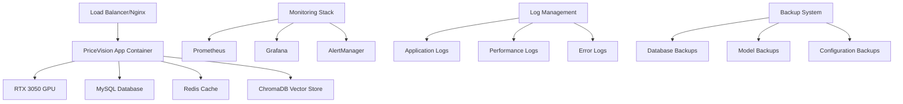

# Phase 5: Production Deployment & Maintenance - RTX 3050 Optimized (2-3 weeks)

## Overview
This phase covers production deployment, monitoring setup, maintenance procedures, and scaling strategies specifically optimized for RTX 3050 hardware constraints.

## Production Deployment Architecture



## Week 1: Production Environment Setup

### Infrastructure Deployment

```bash
#!/bin/bash
# deploy_production.sh - RTX 3050 Production Deployment

set -e

echo "🚀 Starting PriceVision Production Deployment for RTX 3050"

# Check GPU availability
if ! nvidia-smi > /dev/null 2>&1; then
    echo "❌ NVIDIA GPU not detected. RTX 3050 required."
    exit 1
fi

# Verify RTX 3050 specifications
GPU_MEMORY=$(nvidia-smi --query-gpu=memory.total --format=csv,noheader,nounits | head -1)
if [ "$GPU_MEMORY" -lt 4000 ]; then
    echo "❌ Insufficient GPU memory. RTX 3050 (4GB) required."
    exit 1
fi

echo "✅ RTX 3050 detected with ${GPU_MEMORY}MB VRAM"

# Create production directories
mkdir -p /opt/pricevision/{data,logs,backups,config}
mkdir -p /opt/pricevision/data/{chroma_db,models,uploads}

# Set permissions
chown -R pricevision:pricevision /opt/pricevision
chmod -R 755 /opt/pricevision

# Deploy Docker containers
echo "📦 Deploying Docker containers..."
cd /opt/pricevision
docker-compose -f docker-compose.production.yml up -d

# Wait for services to start
echo "⏳ Waiting for services to initialize..."
sleep 30

# Run health checks
echo "🔍 Running health checks..."
./scripts/health_check.sh

# Initialize database
echo "🗄️ Initializing database..."
docker-compose exec pricevision-app python scripts/init_database.py

# Load initial data
echo "📊 Loading initial game data..."
docker-compose exec pricevision-app python scripts/load_initial_data.py

# Test GPU functionality
echo "🎮 Testing GPU functionality..."
docker-compose exec pricevision-app python scripts/test_gpu.py

echo "✅ Production deployment completed successfully!"
echo "🌐 Application available at: http://localhost:8000"
echo "📊 Monitoring available at: http://localhost:3000"
```

### Production Configuration Management

```python
# config_manager.py - Production Configuration for RTX 3050
import os
import json
import yaml
from pathlib import Path
from typing import Dict, Any, Optional
import logging

class ProductionConfigManager:
    def __init__(self, config_dir: str = "/opt/pricevision/config"):
        self.config_dir = Path(config_dir)
        self.config_dir.mkdir(parents=True, exist_ok=True)
        
        # RTX 3050 specific settings
        self.rtx3050_config = {
            "gpu": {
                "max_memory_mb": 3500,
                "memory_fraction": 0.85,
                "allow_growth": True,
                "enable_fp16": True
            },
            "models": {
                "max_concurrent_models": 2,
                "enable_model_swapping": True,
                "swap_threshold_mb": 3000,
                "preload_models": False
            },
            "performance": {
                "max_concurrent_requests": 5,
                "request_timeout": 30,
                "batch_size": 1,
                "enable_caching": True
            }
        }
        
        self.load_configurations()
    
    def load_configurations(self):
        """Load all configuration files"""
        try:
            # Load main application config
            self.app_config = self._load_config_file("app_config.yml")
            
            # Load database config
            self.db_config = self._load_config_file("database.yml")
            
            # Load monitoring config
            self.monitoring_config = self._load_config_file("monitoring.yml")
            
            # Merge with RTX 3050 optimizations
            self._apply_rtx3050_optimizations()
            
        except Exception as e:
            logging.error(f"Failed to load configurations: {e}")
            self._create_default_configs()
    
    def _load_config_file(self, filename: str) -> Dict[str, Any]:
        """Load a specific configuration file"""
        config_path = self.config_dir / filename
        
        if not config_path.exists():
            return {}
        
        with open(config_path, 'r') as f:
            if filename.endswith('.yml') or filename.endswith('.yaml'):
                return yaml.safe_load(f)
            elif filename.endswith('.json'):
                return json.load(f)
            else:
                return {}
    
    def _apply_rtx3050_optimizations(self):
        """Apply RTX 3050 specific optimizations to configurations"""
        # Update app config with GPU constraints
        if 'gpu' not in self.app_config:
            self.app_config['gpu'] = {}
        
        self.app_config['gpu'].update(self.rtx3050_config['gpu'])
        self.app_config['models'] = self.rtx3050_config['models']
        self.app_config['performance'] = self.rtx3050_config['performance']
        
        # Update database config for limited resources
        if 'connection_pool' not in self.db_config:
            self.db_config['connection_pool'] = {}
        
        self.db_config['connection_pool'].update({
            'pool_size': 5,
            'max_overflow': 10,
            'pool_timeout': 30,
            'pool_recycle': 3600
        })
    
    def _create_default_configs(self):
        """Create default configuration files"""
        # Default app config
        default_app_config = {
            'environment': 'production',
            'debug': False,
            'gpu': self.rtx3050_config['gpu'],
            'models': self.rtx3050_config['models'],
            'performance': self.rtx3050_config['performance'],
            'api': {
                'host': '0.0.0.0',
                'port': 8000,
                'workers': 1,  # Single worker for RTX 3050
                'max_requests': 1000,
                'timeout': 30
            },
            'security': {
                'cors_origins': ['*'],
                'rate_limit': '60/minute',
                'max_file_size': '10MB'
            }
        }
        
        # Default database config
        default_db_config = {
            'host': os.getenv('DB_HOST', 'localhost'),
            'port': int(os.getenv('DB_PORT', 3306)),
            'database': os.getenv('DB_NAME', 'pricevision'),
            'username': os.getenv('DB_USER', 'pricevision'),
            'password': os.getenv('DB_PASSWORD', ''),
            'connection_pool': {
                'pool_size': 5,
                'max_overflow': 10,
                'pool_timeout': 30,
                'pool_recycle': 3600
            }
        }
        
        # Default monitoring config
        default_monitoring_config = {
            'prometheus': {
                'enabled': True,
                'port': 9090,
                'metrics_path': '/metrics'
            },
            'logging': {
                'level': 'INFO',
                'format': 'json',
                'files': {
                    'app': '/opt/pricevision/logs/app.log',
                    'performance': '/opt/pricevision/logs/performance.log',
                    'error': '/opt/pricevision/logs/error.log'
                }
            },
            'alerts': {
                'gpu_memory_threshold': 90,
                'cpu_threshold': 80,
                'response_time_threshold': 30,
                'error_rate_threshold': 5
            }
        }
        
        # Save default configs
        self._save_config('app_config.yml', default_app_config)
        self._save_config('database.yml', default_db_config)
        self._save_config('monitoring.yml', default_monitoring_config)
        
        # Load the newly created configs
        self.app_config = default_app_config
        self.db_config = default_db_config
        self.monitoring_config = default_monitoring_config
    
    def _save_config(self, filename: str, config: Dict[str, Any]):
        """Save configuration to file"""
        config_path = self.config_dir / filename
        
        with open(config_path, 'w') as f:
            if filename.endswith('.yml') or filename.endswith('.yaml'):
                yaml.dump(config, f, default_flow_style=False)
            elif filename.endswith('.json'):
                json.dump(config, f, indent=2)
    
    def get_config(self, config_type: str) -> Dict[str, Any]:
        """Get specific configuration"""
        configs = {
            'app': self.app_config,
            'database': self.db_config,
            'monitoring': self.monitoring_config
        }
        return configs.get(config_type, {})
    
    def update_config(self, config_type: str, updates: Dict[str, Any]):
        """Update configuration with new values"""
        if config_type == 'app':
            self.app_config.update(updates)
            self._save_config('app_config.yml', self.app_config)
        elif config_type == 'database':
            self.db_config.update(updates)
            self._save_config('database.yml', self.db_config)
        elif config_type == 'monitoring':
            self.monitoring_config.update(updates)
            self._save_config('monitoring.yml', self.monitoring_config)
    
    def validate_rtx3050_constraints(self) -> Dict[str, bool]:
        """Validate that configurations meet RTX 3050 constraints"""
        validation_results = {}
        
        # Check GPU memory settings
        gpu_config = self.app_config.get('gpu', {})
        max_memory = gpu_config.get('max_memory_mb', 0)
        validation_results['gpu_memory_limit'] = max_memory <= 3500
        
        # Check concurrent request limits
        perf_config = self.app_config.get('performance', {})
        max_requests = perf_config.get('max_concurrent_requests', 0)
        validation_results['concurrent_requests'] = max_requests <= 5
        
        # Check model loading strategy
        model_config = self.app_config.get('models', {})
        preload_models = model_config.get('preload_models', True)
        validation_results['model_preloading'] = not preload_models
        
        # Check API worker count
        api_config = self.app_config.get('api', {})
        workers = api_config.get('workers', 1)
        validation_results['api_workers'] = workers == 1
        
        return validation_results
```

### Monitoring and Alerting Setup

```yaml
# prometheus.yml - Monitoring Configuration
global:
  scrape_interval: 15s
  evaluation_interval: 15s

rule_files:
  - "alert_rules.yml"

alerting:
  alertmanagers:
    - static_configs:
        - targets:
          - alertmanager:9093

scrape_configs:
  - job_name: 'pricevision'
    static_configs:
      - targets: ['pricevision-app:9090']
    scrape_interval: 10s
    metrics_path: /metrics
    
  - job_name: 'node-exporter'
    static_configs:
      - targets: ['node-exporter:9100']
    
  - job_name: 'nvidia-gpu'
    static_configs:
      - targets: ['nvidia-gpu-exporter:9445']
```

```yaml
# alert_rules.yml - RTX 3050 Specific Alerts
groups:
  - name: pricevision_rtx3050_alerts
    rules:
      # GPU Memory Alert
      - alert: HighGPUMemoryUsage
        expr: pricevision_gpu_memory_bytes / (4 * 1024 * 1024 * 1024) > 0.9
        for: 2m
        labels:
          severity: warning
        annotations:
          summary: "RTX 3050 GPU memory usage is high"
          description: "GPU memory usage is {{ $value | humanizePercentage }} of 4GB capacity"
      
      # GPU Temperature Alert
      - alert: HighGPUTemperature
        expr: pricevision_gpu_temperature_celsius > 80
        for: 5m
        labels:
          severity: warning
        annotations:
          summary: "RTX 3050 GPU temperature is high"
          description: "GPU temperature is {{ $value }}°C"
      
      # Response Time Alert
      - alert: HighResponseTime
        expr: histogram_quantile(0.95, pricevision_request_duration_seconds) > 30
        for: 5m
        labels:
          severity: warning
        annotations:
          summary: "High response time detected"
          description: "95th percentile response time is {{ $value }}s"
      
      # Memory Swap Alert
      - alert: FrequentMemorySwaps
        expr: rate(pricevision_memory_swaps_total[5m]) > 0.1
        for: 2m
        labels:
          severity: warning
        annotations:
          summary: "Frequent model memory swaps detected"
          description: "Memory swaps occurring at {{ $value }} per second"
      
      # Error Rate Alert
      - alert: HighErrorRate
        expr: rate(pricevision_requests_total{status="error"}[5m]) / rate(pricevision_requests_total[5m]) > 0.05
        for: 3m
        labels:
          severity: critical
        annotations:
          summary: "High error rate detected"
          description: "Error rate is {{ $value | humanizePercentage }}"
      
      # Service Down Alert
      - alert: ServiceDown
        expr: up{job="pricevision"} == 0
        for: 1m
        labels:
          severity: critical
        annotations:
          summary: "PriceVision service is down"
          description: "PriceVision service has been down for more than 1 minute"
```

## Week 2: Backup and Recovery Systems

### Automated Backup System

```python
# backup_manager.py - Production Backup System
import os
import shutil
import subprocess
import logging
import schedule
import time
from datetime import datetime, timedelta
from pathlib import Path
import boto3
from typing import List, Dict, Optional
import mysql.connector
import json

class ProductionBackupManager:
    def __init__(self, config: Dict[str, Any]):
        self.config = config
        self.backup_dir = Path(config['backup_dir'])
        self.backup_dir.mkdir(parents=True, exist_ok=True)
        
        # Setup logging
        logging.basicConfig(
            level=logging.INFO,
            format='%(asctime)s - %(name)s - %(levelname)s - %(message)s',
            handlers=[
                logging.FileHandler('/opt/pricevision/logs/backup.log'),
                logging.StreamHandler()
            ]
        )
        self.logger = logging.getLogger('backup_manager')
        
        # Initialize cloud storage if configured
        self.s3_client = None
        if config.get('aws_s3', {}).get('enabled', False):
            self.s3_client = boto3.client('s3')
            self.s3_bucket = config['aws_s3']['bucket']
    
    def backup_database(self) -> str:
        """Backup MySQL database"""
        timestamp = datetime.now().strftime('%Y%m%d_%H%M%S')
        backup_filename = f"database_backup_{timestamp}.sql"
        backup_path = self.backup_dir / backup_filename
        
        try:
            # Create mysqldump command
            cmd = [
                'mysqldump',
                f"--host={self.config['database']['host']}",
                f"--user={self.config['database']['username']}",
                f"--password={self.config['database']['password']}",
                '--single-transaction',
                '--routines',
                '--triggers',
                self.config['database']['database']
            ]
            
            # Execute backup
            with open(backup_path, 'w') as f:
                subprocess.run(cmd, stdout=f, check=True)
            
            # Compress backup
            compressed_path = f"{backup_path}.gz"
            subprocess.run(['gzip', str(backup_path)], check=True)
            
            self.logger.info(f"Database backup completed: {compressed_path}")
            
            # Upload to S3 if configured
            if self.s3_client:
                self._upload_to_s3(compressed_path, f"database/{backup_filename}.gz")
            
            return compressed_path
            
        except subprocess.CalledProcessError as e:
            self.logger.error(f"Database backup failed: {e}")
            raise
    
    def backup_models(self) -> str:
        """Backup model files and configurations"""
        timestamp = datetime.now().strftime('%Y%m%d_%H%M%S')
        backup_filename = f"models_backup_{timestamp}.tar.gz"
        backup_path = self.backup_dir / backup_filename
        
        try:
            # Create tar archive of model directory
            model_dir = "/opt/pricevision/data/models"
            cmd = [
                'tar', '-czf', str(backup_path),
                '-C', '/opt/pricevision/data',
                'models'
            ]
            
            subprocess.run(cmd, check=True)
            
            self.logger.info(f"Models backup completed: {backup_path}")
            
            # Upload to S3 if configured
            if self.s3_client:
                self._upload_to_s3(str(backup_path), f"models/{backup_filename}")
            
            return str(backup_path)
            
        except subprocess.CalledProcessError as e:
            self.logger.error(f"Models backup failed: {e}")
            raise
    
    def backup_vector_database(self) -> str:
        """Backup ChromaDB vector database"""
        timestamp = datetime.now().strftime('%Y%m%d_%H%M%S')
        backup_filename = f"vectordb_backup_{timestamp}.tar.gz"
        backup_path = self.backup_dir / backup_filename
        
        try:
            # Create tar archive of ChromaDB directory
            chroma_dir = "/opt/pricevision/data/chroma_db"
            cmd = [
                'tar', '-czf', str(backup_path),
                '-C', '/opt/pricevision/data',
                'chroma_db'
            ]
            
            subprocess.run(cmd, check=True)
            
            self.logger.info(f"Vector database backup completed: {backup_path}")
            
            # Upload to S3 if configured
            if self.s3_client:
                self._upload_to_s3(str(backup_path), f"vectordb/{backup_filename}")
            
            return str(backup_path)
            
        except subprocess.CalledProcessError as e:
            self.logger.error(f"Vector database backup failed: {e}")
            raise
    
    def backup_configuration(self) -> str:
        """Backup configuration files"""
        timestamp = datetime.now().strftime('%Y%m%d_%H%M%S')
        backup_filename = f"config_backup_{timestamp}.tar.gz"
        backup_path = self.backup_dir / backup_filename
        
        try:
            # Create tar archive of config directory
            config_dir = "/opt/pricevision/config"
            cmd = [
                'tar', '-czf', str(backup_path),
                '-C', '/opt/pricevision',
                'config'
            ]
            
            subprocess.run(cmd, check=True)
            
            self.logger.info(f"Configuration backup completed: {backup_path}")
            
            # Upload to S3 if configured
            if self.s3_client:
                self._upload_to_s3(str(backup_path), f"config/{backup_filename}")
            
            return str(backup_path)
            
        except subprocess.CalledProcessError as e:
            self.logger.error(f"Configuration backup failed: {e}")
            raise
    
    def full_backup(self) -> Dict[str, str]:
        """Perform full system backup"""
        self.logger.info("Starting full system backup...")
        
        backup_results = {}
        
        try:
            # Backup database
            backup_results['database'] = self.backup_database()
            
            # Backup models
            backup_results['models'] = self.backup_models()
            
            # Backup vector database
            backup_results['vectordb'] = self.backup_vector_database()
            
            # Backup configuration
            backup_results['config'] = self.backup_configuration()
            
            # Create backup manifest
            manifest = {
                'timestamp': datetime.now().isoformat(),
                'backups': backup_results,
                'system_info': {
                    'gpu': self._get_gpu_info(),
                    'disk_usage': self._get_disk_usage()
                }
            }
            
            manifest_path = self.backup_dir / f"backup_manifest_{datetime.now().strftime('%Y%m%d_%H%M%S')}.json"
            with open(manifest_path, 'w') as f:
                json.dump(manifest, f, indent=2)
            
            self.logger.info("Full backup completed successfully")
            return backup_results
            
        except Exception as e:
            self.logger.error(f"Full backup failed: {e}")
            raise
    
    def cleanup_old_backups(self, retention_days: int = 7):
        """Clean up old backup files"""
        cutoff_date = datetime.now() - timedelta(days=retention_days)
        
        for backup_file in self.backup_dir.glob("*"):
            if backup_file.is_file():
                file_time = datetime.fromtimestamp(backup_file.stat().st_mtime)
                if file_time < cutoff_date:
                    backup_file.unlink()
                    self.logger.info(f"Deleted old backup: {backup_file}")
    
    def _upload_to_s3(self, local_path: str, s3_key: str):
        """Upload backup file to S3"""
        try:
            self.s3_client.upload_file(local_path, self.s3_bucket, s3_key)
            self.logger.info(f"Uploaded to S3: s3://{self.s3_bucket}/{s3_key}")
        except Exception as e:
            self.logger.error(f"S3 upload failed: {e}")
    
    def _get_gpu_info(self) -> Dict[str, Any]:
        """Get GPU information for backup manifest"""
        try:
            result = subprocess.run(['nvidia-smi', '--query-gpu=name,memory.total,memory.used', '--format=csv,noheader,nounits'], 
                                  capture_output=True, text=True)
            if result.returncode == 0:
                gpu_info = result.stdout.strip().split(', ')
                return {
                    'name': gpu_info[0],
                    'memory_total_mb': int(gpu_info[1]),
                    'memory_used_mb': int(gpu_info[2])
                }
        except Exception:
            pass
        return {}
    
    def _get_disk_usage(self) -> Dict[str, Any]:
        """Get disk usage information"""
        try:
            usage = shutil.disk_usage('/opt/pricevision')
            return {
                'total_gb': usage.total / (1024**3),
                'used_gb': usage.used / (1024**3),
                'free_gb': usage.free / (1024**3)
            }
        except Exception:
            return {}
    
    def schedule_backups(self):
        """Schedule automated backups"""
        # Daily database backup at 2 AM
        schedule.every().day.at("02:00").do(self.backup_database)
        
        # Weekly full backup on Sunday at 1 AM
        schedule.every().sunday.at("01:00").do(self.full_backup)
        
        # Daily cleanup at 3 AM
        schedule.every().day.at("03:00").do(self.cleanup_old_backups)
        
        self.logger.info("Backup schedule configured")
        
        # Run scheduler
        while True:
            schedule.run_pending()
            time.sleep(60)

# Recovery procedures
class RecoveryManager:
    def __init__(self, config: Dict[str, Any]):
        self.config = config
        self.backup_dir = Path(config['backup_dir'])
        self.logger = logging.getLogger('recovery_manager')
    
    def restore_database(self, backup_file: str):
        """Restore database from backup"""
        try:
            # Decompress if needed
            if backup_file.endswith('.gz'):
                subprocess.run(['gunzip', backup_file], check=True)
                backup_file = backup_file[:-3]  # Remove .gz extension
            
            # Restore database
            cmd = [
                'mysql',
                f"--host={self.config['database']['host']}",
                f"--user={self.config['database']['username']}",
                f"--password={self.config['database']['password']}",
                self.config['database']['database']
            ]
            
            with open(backup_file, 'r') as f:
                subprocess.run(cmd, stdin=f, check=True)
            
            self.logger.info(f"Database restored from: {backup_file}")
            
        except subprocess.CalledProcessError as e:
            self.logger.error(f"Database restore failed: {e}")
            raise
    
    def restore_models(self, backup_file: str):
        """Restore model files from backup"""
        try:
            # Extract models
            cmd = [
                'tar', '-xzf', backup_file,
                '-C', '/opt/pricevision/data'
            ]
            
            subprocess.run(cmd, check=True)
            
            self.logger.info(f"Models restored from: {backup_file}")
            
        except subprocess.CalledProcessError as e:
            self.logger.error(f"Models restore failed: {e}")
            raise
    
    def disaster_recovery(self, backup_manifest: str):
        """Perform complete disaster recovery"""
        try:
            # Load backup manifest
            with open(backup_manifest, 'r') as f:
                manifest = json.load(f)
            
            backups = manifest['backups']
            
            # Restore in order
            self.restore_database(backups['database'])
            self.restore_models(backups['models'])
            
            # Restore vector database
            subprocess.run([
                'tar', '-xzf', backups['vectordb'],
                '-C', '/opt/pricevision/data'
            ], check=True)
            
            # Restore configuration
            subprocess.run([
                'tar', '-xzf', backups['config'],
                '-C', '/opt/pricevision'
            ], check=True)
            
            self.logger.info("Disaster recovery completed successfully")
            
        except Exception as e:
            self.logger.error(f"Disaster recovery failed: {e}")
            raise
```

## Week 3: Scaling and Optimization

### Performance Optimization Scripts

```python
# performance_optimizer.py - RTX 3050 Performance Optimization
import torch
import psutil
import time
import logging
from typing import Dict, List, Any
import numpy as np
from dataclasses import dataclass
import json

@dataclass
class PerformanceMetrics:
    gpu_memory_usage: float
    cpu_usage: float
    response_time: float
    throughput: float
    error_rate: float
    gpu_temperature: float

class RTX3050PerformanceOptimizer:
    def __init__(self):
        self.logger = logging.getLogger('performance_optimizer')
        self.baseline_metrics = None
        self.optimization_history = []
        
        # RTX 3050 specific thresholds
        self.thresholds = {
            'gpu_memory_warning': 3000,  # MB
            'gpu_memory_critical': 3400,  # MB
            'gpu_temperature_warning': 75,  # Celsius
            'gpu_temperature_critical': 85,  # Celsius
            'response_time_target': 15.0,  # seconds
            'cpu_usage_warning': 80,  # percent
        }
    
    def collect_metrics(self) -> PerformanceMetrics:
        """Collect current performance metrics"""
        # GPU metrics
        gpu_memory = 0
        gpu_temp = 0
        if torch.cuda.is_available():
            gpu_memory = torch.cuda.memory_allocated(0) / (1024 * 1024)  # MB
            try:
                import pynvml
                pynvml.nvmlInit()
                handle = pynvml.nvmlDeviceGetHandleByIndex(0)
                gpu_temp = pynvml.nvmlDeviceGetTemperature(handle, pynvml.NVML_TEMPERATURE_GPU)
            except ImportError:
                pass
        
        # CPU metrics
        cpu_usage = psutil.cpu_percent(interval=1)
        
        # Mock response time and throughput (would be collected from actual metrics)
        response_time = 10.0  # Would come from monitoring system
        throughput = 5.0  # Requests per minute
        error_rate = 0.02  # 2% error rate
        
        return PerformanceMetrics(
            gpu_memory_usage=gpu_memory,
            cpu_usage=cpu_usage,
            response_time=response_time,
            throughput=throughput,
            error_rate=error_rate,
            gpu_temperature=gpu_temp
        )
    
    def analyze_performance(self, metrics: PerformanceMetrics) -> Dict[str, Any]:
        """Analyze performance metrics and identify issues"""
        analysis = {
            'status': 'healthy',
            'issues': [],
            'recommendations': []
        }
        
        # Check GPU memory usage
        if metrics.gpu_memory_usage > self.thresholds['gpu_memory_critical']:
            analysis['status'] = 'critical'
            analysis['issues'].append('GPU memory usage critical')
            analysis['recommendations'].append('Enable aggressive model swapping')
            analysis['recommendations'].append('Reduce batch size')
        elif metrics.gpu_memory_usage >